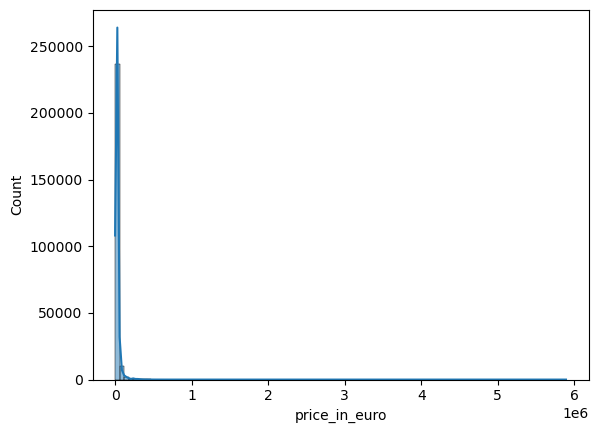
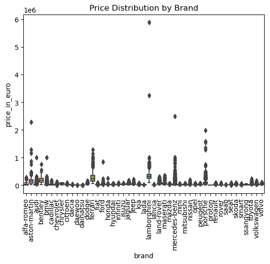
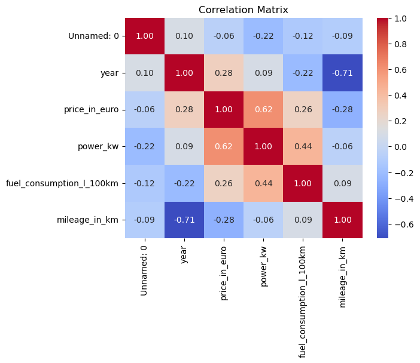
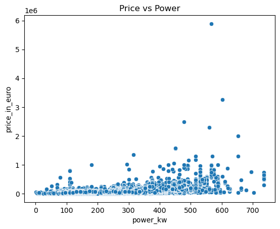
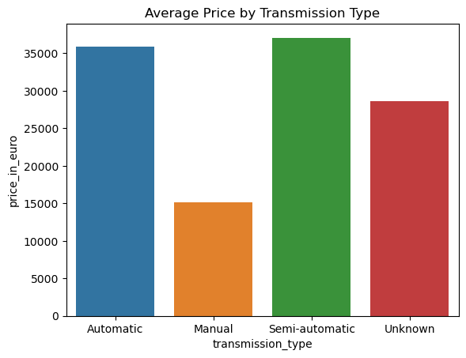

 Predict the price of a used vehicle in Germany based on features : 

Gather and Load Data


```python
import pandas as pd

df = pd.read_csv('data.csv')
df.head()
```


<div>
<style scoped>
    .dataframe tbody tr th:only-of-type {
        vertical-align: middle;
    }

    .dataframe tbody tr th {
        vertical-align: top;
    }

    .dataframe thead th {
        text-align: right;
    }
</style>
<table border="1" class="dataframe">
  <thead>
    <tr style="text-align: right;">
      <th></th>
      <th>Unnamed: 0</th>
      <th>brand</th>
      <th>model</th>
      <th>color</th>
      <th>registration_date</th>
      <th>year</th>
      <th>price_in_euro</th>
      <th>power_kw</th>
      <th>power_ps</th>
      <th>transmission_type</th>
      <th>fuel_type</th>
      <th>fuel_consumption_l_100km</th>
      <th>fuel_consumption_g_km</th>
      <th>mileage_in_km</th>
      <th>offer_description</th>
    </tr>
  </thead>
  <tbody>
    <tr>
      <th>0</th>
      <td>0</td>
      <td>alfa-romeo</td>
      <td>Alfa Romeo GTV</td>
      <td>red</td>
      <td>10/1995</td>
      <td>1995</td>
      <td>1300</td>
      <td>148</td>
      <td>201</td>
      <td>Manual</td>
      <td>Petrol</td>
      <td>10,9 l/100 km</td>
      <td>260 g/km</td>
      <td>160500.0</td>
      <td>2.0 V6 TB</td>
    </tr>
    <tr>
      <th>1</th>
      <td>1</td>
      <td>alfa-romeo</td>
      <td>Alfa Romeo 164</td>
      <td>black</td>
      <td>02/1995</td>
      <td>1995</td>
      <td>24900</td>
      <td>191</td>
      <td>260</td>
      <td>Manual</td>
      <td>Petrol</td>
      <td>NaN</td>
      <td>- (g/km)</td>
      <td>190000.0</td>
      <td>Q4 Allrad, 3.2L GTA</td>
    </tr>
    <tr>
      <th>2</th>
      <td>2</td>
      <td>alfa-romeo</td>
      <td>Alfa Romeo Spider</td>
      <td>black</td>
      <td>02/1995</td>
      <td>1995</td>
      <td>5900</td>
      <td>110</td>
      <td>150</td>
      <td>Unknown</td>
      <td>Petrol</td>
      <td>NaN</td>
      <td>- (g/km)</td>
      <td>129000.0</td>
      <td>ALFA ROME 916</td>
    </tr>
    <tr>
      <th>3</th>
      <td>3</td>
      <td>alfa-romeo</td>
      <td>Alfa Romeo Spider</td>
      <td>black</td>
      <td>07/1995</td>
      <td>1995</td>
      <td>4900</td>
      <td>110</td>
      <td>150</td>
      <td>Manual</td>
      <td>Petrol</td>
      <td>9,5 l/100 km</td>
      <td>225 g/km</td>
      <td>189500.0</td>
      <td>2.0 16V Twin Spark L</td>
    </tr>
    <tr>
      <th>4</th>
      <td>4</td>
      <td>alfa-romeo</td>
      <td>Alfa Romeo 164</td>
      <td>red</td>
      <td>11/1996</td>
      <td>1996</td>
      <td>17950</td>
      <td>132</td>
      <td>179</td>
      <td>Manual</td>
      <td>Petrol</td>
      <td>7,2 l/100 km</td>
      <td>- (g/km)</td>
      <td>96127.0</td>
      <td>3.0i Super V6, absoluter Topzustand !</td>
    </tr>
  </tbody>
</table>
</div>


Data Exploration and Cleaning


```python
df = df.drop(columns=['color', 'registration_date', 'offer_description'])
```


```python
df.head()
```


<div>
<style scoped>
    .dataframe tbody tr th:only-of-type {
        vertical-align: middle;
    }

    .dataframe tbody tr th {
        vertical-align: top;
    }

    .dataframe thead th {
        text-align: right;
    }
</style>
<table border="1" class="dataframe">
  <thead>
    <tr style="text-align: right;">
      <th></th>
      <th>Unnamed: 0</th>
      <th>brand</th>
      <th>model</th>
      <th>year</th>
      <th>price_in_euro</th>
      <th>power_kw</th>
      <th>power_ps</th>
      <th>transmission_type</th>
      <th>fuel_type</th>
      <th>fuel_consumption_l_100km</th>
      <th>fuel_consumption_g_km</th>
      <th>mileage_in_km</th>
    </tr>
  </thead>
  <tbody>
    <tr>
      <th>0</th>
      <td>0</td>
      <td>alfa-romeo</td>
      <td>Alfa Romeo GTV</td>
      <td>1995</td>
      <td>1300</td>
      <td>148</td>
      <td>201</td>
      <td>Manual</td>
      <td>Petrol</td>
      <td>10,9 l/100 km</td>
      <td>260 g/km</td>
      <td>160500.0</td>
    </tr>
    <tr>
      <th>1</th>
      <td>1</td>
      <td>alfa-romeo</td>
      <td>Alfa Romeo 164</td>
      <td>1995</td>
      <td>24900</td>
      <td>191</td>
      <td>260</td>
      <td>Manual</td>
      <td>Petrol</td>
      <td>NaN</td>
      <td>- (g/km)</td>
      <td>190000.0</td>
    </tr>
    <tr>
      <th>2</th>
      <td>2</td>
      <td>alfa-romeo</td>
      <td>Alfa Romeo Spider</td>
      <td>1995</td>
      <td>5900</td>
      <td>110</td>
      <td>150</td>
      <td>Unknown</td>
      <td>Petrol</td>
      <td>NaN</td>
      <td>- (g/km)</td>
      <td>129000.0</td>
    </tr>
    <tr>
      <th>3</th>
      <td>3</td>
      <td>alfa-romeo</td>
      <td>Alfa Romeo Spider</td>
      <td>1995</td>
      <td>4900</td>
      <td>110</td>
      <td>150</td>
      <td>Manual</td>
      <td>Petrol</td>
      <td>9,5 l/100 km</td>
      <td>225 g/km</td>
      <td>189500.0</td>
    </tr>
    <tr>
      <th>4</th>
      <td>4</td>
      <td>alfa-romeo</td>
      <td>Alfa Romeo 164</td>
      <td>1996</td>
      <td>17950</td>
      <td>132</td>
      <td>179</td>
      <td>Manual</td>
      <td>Petrol</td>
      <td>7,2 l/100 km</td>
      <td>- (g/km)</td>
      <td>96127.0</td>
    </tr>
  </tbody>
</table>
</div>


```python
print(df.isnull().sum())
```

    Unnamed: 0                      0
    brand                           0
    model                           0
    year                            0
    price_in_euro                   0
    power_kw                      134
    power_ps                      129
    transmission_type               0
    fuel_type                       0
    fuel_consumption_l_100km    26873
    fuel_consumption_g_km           0
    mileage_in_km                 152
    dtype: int64
    


```python
print(df.dtypes)
```

    Unnamed: 0                    int64
    brand                        object
    model                        object
    year                         object
    price_in_euro                object
    power_kw                     object
    power_ps                     object
    transmission_type            object
    fuel_type                    object
    fuel_consumption_l_100km     object
    fuel_consumption_g_km        object
    mileage_in_km               float64
    dtype: object
    


```python
# Step 1: Convert 'year' to numeric
df['year'] = pd.to_numeric(df['year'], errors='coerce')

# Step 2: Convert 'price_in_euro' to numeric 
df['price_in_euro'] = pd.to_numeric(df['price_in_euro'], errors='coerce')

# Step 3: Convert 'power_kw' and 'power_ps' to numeric
df['power_kw'] = pd.to_numeric(df['power_kw'], errors='coerce')
df['power_ps'] = pd.to_numeric(df['power_ps'], errors='coerce')

print(df.dtypes)
```

    Unnamed: 0                    int64
    brand                        object
    model                        object
    year                        float64
    price_in_euro               float64
    power_kw                    float64
    power_ps                    float64
    transmission_type            object
    fuel_type                    object
    fuel_consumption_l_100km     object
    fuel_consumption_g_km        object
    mileage_in_km               float64
    dtype: object
    


```python
# Step 4: Clean 'fuel_consumption_l_100km' and convert to numeric
df['fuel_consumption_l_100km'] = df['fuel_consumption_l_100km'].str.replace(' l/100 km', '')
df['fuel_consumption_l_100km'] = pd.to_numeric(df['fuel_consumption_l_100km'], errors='coerce')

print(df.dtypes)
```

    Unnamed: 0                    int64
    brand                        object
    model                        object
    year                        float64
    price_in_euro               float64
    power_kw                    float64
    power_ps                    float64
    transmission_type            object
    fuel_type                    object
    fuel_consumption_l_100km    float64
    fuel_consumption_g_km        object
    mileage_in_km               float64
    dtype: object
    


```python
original_data = pd.read_csv('data.csv', usecols=['fuel_consumption_l_100km'])
df['fuel_consumption_l_100km'] = original_data['fuel_consumption_l_100km']
print(df['fuel_consumption_l_100km'].head())
```

    0    10,9 l/100 km
    1              NaN
    2              NaN
    3     9,5 l/100 km
    4     7,2 l/100 km
    Name: fuel_consumption_l_100km, dtype: object
    


```python
# Step 4: Clean 'fuel_consumption_l_100km' and convert to numeric
df['fuel_consumption_l_100km'] = df['fuel_consumption_l_100km'].str.strip()
df['fuel_consumption_l_100km'] = df['fuel_consumption_l_100km'].str.replace(' l/100 km', '', regex=False)
df['fuel_consumption_l_100km'] = df['fuel_consumption_l_100km'].str.replace(',', '.', regex=False)

df['fuel_consumption_l_100km'] = pd.to_numeric(df['fuel_consumption_l_100km'], errors='coerce')
print(df['fuel_consumption_l_100km'].head())
```

    0    10.9
    1     NaN
    2     NaN
    3     9.5
    4     7.2
    Name: fuel_consumption_l_100km, dtype: float64
    

Handle power_kw and power_ps:

These columns contain engine power information. Since they're related (1 kW = 1.36 PS), we can fill missing values based on their relationship.


```python
df['power_kw'] = df['power_kw'].fillna(df['power_ps'] * 0.7355)
df['power_ps'] = df['power_ps'].fillna(df['power_kw'] * 1.36)

df['power_kw'].fillna(df['power_kw'].median(), inplace=True)
df['power_ps'].fillna(df['power_ps'].median(), inplace=True)

print(df[['power_kw', 'power_ps']].isnull().sum())
```

    power_kw    0
    power_ps    0
    dtype: int64
    

Handle fuel_consumption_l_100km:

The fuel consumption column has a large number of missing values. We can fill these missing values based on similar rows (e.g., same model, year, and fuel type). 


```python
df['fuel_consumption_l_100km'] = df.groupby(['model', 'year', 'fuel_type'])['fuel_consumption_l_100km'].transform(lambda x: x.fillna(x.median()))
df['fuel_consumption_l_100km'].fillna(df['fuel_consumption_l_100km'].median(), inplace=True)

print(df['fuel_consumption_l_100km'].isnull().sum())
```

    0
    

 Handle mileage_in_km: 
 
 We fill the missing mileage values using the approximation (2023 - year) * average_mileage_per_year, while leaving the existing mileage values intact. 


```python
# Assuming an average mileage of 15,000 km per year
average_mileage_per_year = 15000

df['year'] = df['year'].apply(lambda x: min(int(x), 2023)) 

df['mileage_in_km'] = df['mileage_in_km'].fillna((2023 - df['year']) * average_mileage_per_year).astype('float64')

print("Missing values in 'mileage_in_km':", df['mileage_in_km'].isnull().sum())
```


```python
df['year'].isnull().sum()
```


    195


```python
df_original_data = pd.read_csv('data.csv')

df_original_data['registration_date'] = pd.to_datetime(df_original_data['registration_date'], format='%m/%Y', errors='coerce')
df_original_data['year_from_registration'] = df_original_data['registration_date'].dt.year
df = df.merge(df_original_data[['Unnamed: 0', 'year_from_registration']], on='Unnamed: 0', how='left')
df['year'] = df['year'].fillna(df['year_from_registration'])
df.drop(columns=['year_from_registration'], inplace=True)
print(df[['year']])
```

              year
    0       1995.0
    1       1995.0
    2       1995.0
    3       1995.0
    4       1996.0
    ...        ...
    251074  2023.0
    251075  2023.0
    251076  2023.0
    251077  2023.0
    251078  2023.0
    
    [251079 rows x 1 columns]
    


```python
df['year'].isnull().sum()
```


    195


```python
df = df.dropna(subset=['year'])

print("Remaining rows after dropping missing values in 'year':", df.shape[0])
print("Missing values in the DataFrame after dropping rows:", df.isnull().sum())
```

    Remaining rows after dropping missing values in 'year': 250884
    Missing values in the DataFrame after dropping rows: Unnamed: 0                   0
    brand                        0
    model                        0
    year                         0
    price_in_euro                4
    power_kw                     0
    power_ps                     0
    transmission_type            0
    fuel_type                    0
    fuel_consumption_l_100km     0
    fuel_consumption_g_km        0
    mileage_in_km               66
    dtype: int64
    


```python
df = df.dropna(subset=['price_in_euro', 'mileage_in_km'])
print("Remaining rows after dropping rows with missing values:", df.shape[0])
```

    Remaining rows after dropping rows with missing values: 250818
    


```python
df.drop(columns=['power_ps'], inplace=True)
```


```python
df.drop(columns=['fuel_consumption_g_km'], inplace=True)
```

Exploratory Data Analysis (EDA)


```python
print(df.describe())
```

              Unnamed: 0           year  price_in_euro       power_kw  \
    count  250818.000000  250818.000000   2.508180e+05  250818.000000   
    mean   125532.978451    2016.261552   2.613688e+04     126.220977   
    std     72483.214299       5.462751   3.699225e+04      72.006528   
    min         0.000000    1995.000000   1.200000e+02       1.000000   
    25%     62771.250000    2013.000000   1.199000e+04      82.000000   
    50%    125529.500000    2018.000000   1.989000e+04     110.000000   
    75%    188298.750000    2020.000000   2.995000e+04     140.000000   
    max    251078.000000    2023.000000   5.890500e+06     735.000000   
    
           fuel_consumption_l_100km  mileage_in_km  
    count             250818.000000   2.508180e+05  
    mean                   6.073303   8.536867e+04  
    std                    2.563872   7.872133e+04  
    min                    0.000000   0.000000e+00  
    25%                    4.900000   2.495000e+04  
    50%                    5.700000   6.751500e+04  
    75%                    6.700000   1.265385e+05  
    max                  173.000000   3.800000e+06  
    


```python
sns.histplot(df['price_in_euro'], bins=100, kde=True)  
```

    c:\Users\aicha\anaconda3\lib\site-packages\seaborn\_oldcore.py:1119: FutureWarning: use_inf_as_na option is deprecated and will be removed in a future version. Convert inf values to NaN before operating instead.
      with pd.option_context('mode.use_inf_as_na', True):
    


    <Axes: xlabel='price_in_euro', ylabel='Count'>


    

    


```python
sns.boxplot(x='brand', y='price_in_euro', data=df)
plt.xticks(rotation=90)
plt.title('Price Distribution by Brand')
plt.show()
```


    

    


```python
numeric_df = df.select_dtypes(include=['float64', 'int64'])  # Select only numeric columns
correlation_matrix = numeric_df.corr()
sns.heatmap(correlation_matrix, annot=True, fmt=".2f", cmap="coolwarm")
plt.title('Correlation Matrix')
plt.show()
```


    

    


Feature Engineering


```python
df['car_age'] = 2023 - df['year']
```


```python
df['fuel_efficiency'] = 100 / df['fuel_consumption_l_100km']  # l/100 km to km/l
```


```python
df.head()
```


<div>
<style scoped>
    .dataframe tbody tr th:only-of-type {
        vertical-align: middle;
    }

    .dataframe tbody tr th {
        vertical-align: top;
    }

    .dataframe thead th {
        text-align: right;
    }
</style>
<table border="1" class="dataframe">
  <thead>
    <tr style="text-align: right;">
      <th></th>
      <th>Unnamed: 0</th>
      <th>brand</th>
      <th>model</th>
      <th>year</th>
      <th>price_in_euro</th>
      <th>power_kw</th>
      <th>transmission_type</th>
      <th>fuel_type</th>
      <th>fuel_consumption_l_100km</th>
      <th>mileage_in_km</th>
      <th>car_age</th>
      <th>fuel_efficiency</th>
    </tr>
  </thead>
  <tbody>
    <tr>
      <th>0</th>
      <td>0</td>
      <td>alfa-romeo</td>
      <td>Alfa Romeo GTV</td>
      <td>1995.0</td>
      <td>1300.0</td>
      <td>148.0</td>
      <td>Manual</td>
      <td>Petrol</td>
      <td>10.9</td>
      <td>160500.0</td>
      <td>28.0</td>
      <td>9.174312</td>
    </tr>
    <tr>
      <th>1</th>
      <td>1</td>
      <td>alfa-romeo</td>
      <td>Alfa Romeo 164</td>
      <td>1995.0</td>
      <td>24900.0</td>
      <td>191.0</td>
      <td>Manual</td>
      <td>Petrol</td>
      <td>5.7</td>
      <td>190000.0</td>
      <td>28.0</td>
      <td>17.543860</td>
    </tr>
    <tr>
      <th>2</th>
      <td>2</td>
      <td>alfa-romeo</td>
      <td>Alfa Romeo Spider</td>
      <td>1995.0</td>
      <td>5900.0</td>
      <td>110.0</td>
      <td>Unknown</td>
      <td>Petrol</td>
      <td>9.5</td>
      <td>129000.0</td>
      <td>28.0</td>
      <td>10.526316</td>
    </tr>
    <tr>
      <th>3</th>
      <td>3</td>
      <td>alfa-romeo</td>
      <td>Alfa Romeo Spider</td>
      <td>1995.0</td>
      <td>4900.0</td>
      <td>110.0</td>
      <td>Manual</td>
      <td>Petrol</td>
      <td>9.5</td>
      <td>189500.0</td>
      <td>28.0</td>
      <td>10.526316</td>
    </tr>
    <tr>
      <th>4</th>
      <td>4</td>
      <td>alfa-romeo</td>
      <td>Alfa Romeo 164</td>
      <td>1996.0</td>
      <td>17950.0</td>
      <td>132.0</td>
      <td>Manual</td>
      <td>Petrol</td>
      <td>7.2</td>
      <td>96127.0</td>
      <td>27.0</td>
      <td>13.888889</td>
    </tr>
  </tbody>
</table>
</div>


Data Visualization


```python
sns.scatterplot(x='power_kw', y='price_in_euro', data=df)
plt.title('Price vs Power')
plt.show()
```


    

    


```python
avg_price_by_transmission = df.groupby('transmission_type')['price_in_euro'].mean().reset_index()
sns.barplot(x='transmission_type', y='price_in_euro', data=avg_price_by_transmission)
plt.title('Average Price by Transmission Type')
plt.show()
```


    

    


Modeling


```python
from sklearn.linear_model import LinearRegression
from sklearn.tree import DecisionTreeRegressor
from sklearn.ensemble import RandomForestRegressor
from sklearn.ensemble import GradientBoostingRegressor
from sklearn.svm import SVR
```


```python
# One-hot encoding for categorical variables
df_encoded = pd.get_dummies(df, columns=['transmission_type', 'fuel_type'], drop_first=True)

# Splitting the dataset
X = df_encoded.drop(['price_in_euro'], axis=1)  # Features
y = df_encoded['price_in_euro']  # Target variable

X_train, X_test, y_train, y_test = train_test_split(X, y, test_size=0.2, random_state=42)
```


```python
import pandas as pd

# Assuming X_train and X_test are your training and testing DataFrames
# Convert categorical columns to numerical using one-hot encoding
X_train = pd.get_dummies(X_train, drop_first=True)
X_test = pd.get_dummies(X_test, drop_first=True)

# Ensure that both train and test have the same columns
X_train, X_test = X_train.align(X_test, join='left', axis=1, fill_value=0)
```


```python
# Check for NaN values
print(X_train.isna().sum())

# Check for infinite values
print((X_train == float('inf')).sum())
print((X_train == float('-inf')).sum())
```

    Unnamed: 0                            0
    year                                  0
    power_kw                              0
    fuel_consumption_l_100km              0
    mileage_in_km                         0
                                         ..
    model_smart city-coupé/city-cabrio    0
    model_smart forFour                   0
    model_smart forTwo                    0
    model_smart roadster                  0
    model_smart smart #1                  0
    Length: 1347, dtype: int64
    Unnamed: 0                            0
    year                                  0
    power_kw                              0
    fuel_consumption_l_100km              0
    mileage_in_km                         0
                                         ..
    model_smart city-coupé/city-cabrio    0
    model_smart forFour                   0
    model_smart forTwo                    0
    model_smart roadster                  0
    model_smart smart #1                  0
    Length: 1347, dtype: int64
    Unnamed: 0                            0
    year                                  0
    power_kw                              0
    fuel_consumption_l_100km              0
    mileage_in_km                         0
                                         ..
    model_smart city-coupé/city-cabrio    0
    model_smart forFour                   0
    model_smart forTwo                    0
    model_smart roadster                  0
    model_smart smart #1                  0
    Length: 1347, dtype: int64
    


```python
# Check for infinite values
print("Infinite values in training set:")
print((X_train == float('inf')).sum())
print((X_train == float('-inf')).sum())

# Check for infinite values in the test set as well
print("Infinite values in test set:")
print((X_test == float('inf')).sum())
print((X_test == float('-inf')).sum())
```

    Infinite values in training set:
    Unnamed: 0                            0
    year                                  0
    power_kw                              0
    fuel_consumption_l_100km              0
    mileage_in_km                         0
                                         ..
    model_smart city-coupé/city-cabrio    0
    model_smart forFour                   0
    model_smart forTwo                    0
    model_smart roadster                  0
    model_smart smart #1                  0
    Length: 1347, dtype: int64
    Unnamed: 0                            0
    year                                  0
    power_kw                              0
    fuel_consumption_l_100km              0
    mileage_in_km                         0
                                         ..
    model_smart city-coupé/city-cabrio    0
    model_smart forFour                   0
    model_smart forTwo                    0
    model_smart roadster                  0
    model_smart smart #1                  0
    Length: 1347, dtype: int64
    Infinite values in test set:
    Unnamed: 0                            0
    year                                  0
    power_kw                              0
    fuel_consumption_l_100km              0
    mileage_in_km                         0
                                         ..
    model_smart city-coupé/city-cabrio    0
    model_smart forFour                   0
    model_smart forTwo                    0
    model_smart roadster                  0
    model_smart smart #1                  0
    Length: 1347, dtype: int64
    Unnamed: 0                            0
    year                                  0
    power_kw                              0
    fuel_consumption_l_100km              0
    mileage_in_km                         0
                                         ..
    model_smart city-coupé/city-cabrio    0
    model_smart forFour                   0
    model_smart forTwo                    0
    model_smart roadster                  0
    model_smart smart #1                  0
    Length: 1347, dtype: int64
    


```python
# Display the maximum values in the training set
print("Maximum values in training set:")
print(X_train.max())

# Display the maximum values in the test set
print("Maximum values in test set:")
print(X_test.max())
```

    Maximum values in training set:
    Unnamed: 0                               251078
    year                                     2023.0
    power_kw                                  735.0
    fuel_consumption_l_100km                  173.0
    mileage_in_km                         3800000.0
                                            ...    
    model_smart city-coupé/city-cabrio         True
    model_smart forFour                        True
    model_smart forTwo                         True
    model_smart roadster                       True
    model_smart smart #1                       True
    Length: 1347, dtype: object
    Maximum values in test set:
    Unnamed: 0                               251077
    year                                     2023.0
    power_kw                                  735.0
    fuel_consumption_l_100km                  146.0
    mileage_in_km                         2100000.0
                                            ...    
    model_smart city-coupé/city-cabrio         True
    model_smart forFour                        True
    model_smart forTwo                         True
    model_smart roadster                       True
    model_smart smart #1                          0
    Length: 1347, dtype: object
    


```python
# Define a threshold for mileage
mileage_threshold = X_train['mileage_in_km'].quantile(0.99)

# Cap values above this threshold
X_train['mileage_in_km'] = X_train['mileage_in_km'].clip(upper=mileage_threshold)
X_test['mileage_in_km'] = X_test['mileage_in_km'].clip(upper=mileage_threshold)
```


```python
import numpy as np

# Replace infinite values with NaN
X_train.replace([np.inf, -np.inf], np.nan, inplace=True)
X_test.replace([np.inf, -np.inf], np.nan, inplace=True)
```


```python
from sklearn.impute import SimpleImputer

imputer = SimpleImputer(strategy='mean')  # or 'median'
X_train = imputer.fit_transform(X_train)
X_test = imputer.transform(X_test)
```


```python

models = {
    'Linear Regression': LinearRegression(),
    'Decision Tree': DecisionTreeRegressor(),
    # Add other models here if needed
}

# Function to train and evaluate models
def train_and_evaluate_model(model, X_train, y_train, X_test, y_test):
    model.fit(X_train, y_train)
    y_pred = model.predict(X_test)
    
    # Evaluate the model
    mae = mean_absolute_error(y_test, y_pred)
    mse = mean_squared_error(y_test, y_pred)
    r2 = r2_score(y_test, y_pred)
    
    return mae, mse, r2

# Train and evaluate each model
results = {}
for name, model in models.items():
    mae, mse, r2 = train_and_evaluate_model(model, X_train, y_train, X_test, y_test)
    results[name] = {'MAE': mae, 'MSE': mse, 'R2': r2}

# Convert results to DataFrame for better visualization
results_df = pd.DataFrame(results).T
print(results_df)
```

                               MAE           MSE        R2
    Linear Regression  5560.809816  2.550771e+08  0.775604
    Decision Tree      4387.977454  2.835427e+08  0.750562
    

Metric Interpretation

Mean Absolute Error (MAE): The Decision Tree model has a lower MAE, indicating that it generally makes predictions closer to the actual values compared to Linear Regression.

Mean Squared Error (MSE): The Decision Tree has a higher MSE, suggesting it has larger errors in some predictions, despite the lower MAE. This could be due to outliers affecting the MSE more significantly.

R² (Coefficient of Determination): The R² value indicates that Linear Regression explains about 77.6% of the variance in the dependent variable, while the Decision Tree explains 75.1%. This suggests that Linear Regression may fit the data slightly better.
